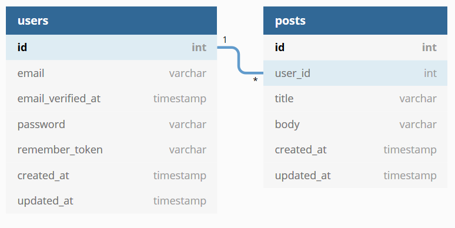

# Technical Test in Laravel

Simple project for a technical test in Laravel. The objective of this assignment is to give us an idea of how you interpret a brief, approach a problem and structure your application.

## Documentation

### Technology

To approach this assignment we would like you to use PHP and Laravel Framework since this is our main stack.
Apart from that, feel free to apply any other acquired knowledge or skill at your discretion.

### Scope

A customer approached us to build a web blogging platform.

The homepage will show all the blog posts to everyone visiting the web. Any user will be able to register in the platform, login to a private area to see the posts he created and, if they want, create new ones. They won't be able to edit or delete them.

The blog posts will only contain a title, description and publication date. The users should be able to sort them by publication_date.

Also, the customer is using another blogging platform and she wants us to auto import the posts created there and add them to our new blogging platform, for that reason, she provided us the following REST api endpoint that returns the new posts. 

The posts from this feed should be saved under a designated, system-created user, 'admin'.

Our customer is a very popular blogger, who generates between 2 and 3 posts an hour. The site which powers the feed linked above is a very popular one (several million visitors a month), and we are expecting a similar level of traffic on our site. One of our goals is to minimise the strain put on our system during traffic peaks, while also minimising the strain we put on the feed server.

## Project insight

### Database Schema

Given the scope and requirements of the project, the database schema is very simple: a table for users and a table for posts, with a **one-to-many relation** user-post. 

### Getting started

First clone the repository and open the project.

Copy .env.example to .env and modify it, adding the new keys and database connection info: host, port, user and password

Run composer install and npm install to download all project packages (npm run dev ???)

Run composer dump-autoload

Run php artisan migrate to create all tables in database and execute AdminUserSeeder, which creates the admin user used in the post fetching process.

Run php artisan serve to get the project running on localhost

### Fetching client's API

For this part, I've developed a new artisan command called fetch-client-posts. If executed, it will fetch posts from the clients API and insert them in DB associated to the default user (admin).

Given the requirements, it is set to execute every 10 minutes via cron at Kernel.php, but it could be lowered if needed after consulting the client.

To start the cron execution you can run php artisan schedule:run. The way Laravel is built, schedule:run will not run an hourly command if not executed in a XX:X0 minute, so to be able to test this locally anytime, I've put an environment check and execute it every minute on environments different from production.

In a more easy fashion and for the sake of testing, we could just execute the new command - either way works.

### Register and login

Placeholder

### Reading posts

Placeholder

### Creating posts

Placeholder

### Protecting against traffic peaks

Throttle, recaptcha
